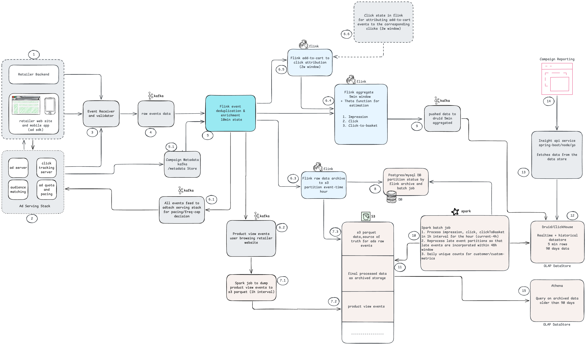

# Retail Media Insights API

Read API for retail media campaign metrics.

Given a campaign and a time range, it returns:

- impression count
- click count
- click to basket count
- estimated number of unique customers in that time range

The numbers come from Druid. Flink writes five minute aggregated row.
In fixed interval batch job rewrites those rows with duplicates/invalid removed.
Both write to the same data store.

The diagram shows the wider system. In this repo, Druid is replaced by an in-memory stub repository.
## Architecture

[](docs/streaming-platform.png)

## Run locally

```bash
mvn spring-boot:run
```

Example requests:

```bash
TOKEN="Authorization: Bearer demo-amazon-token"
BASE="localhost:8080/v1/campaigns/cmp-8842/metrics"
TODAY=$(date +%F)

# hourly metrics for today in Asia/Kolkata
curl -s -H "$TOKEN" "$BASE?from=${TODAY}T00:00&to=${TODAY}T09:00&interval=hour&timezone=Asia/Kolkata" | jq

# daily rollup for today
curl -s -H "$TOKEN" "$BASE?from=${TODAY}T00:00&to=${TODAY}T00:00&interval=day&timezone=Asia/Kolkata" | jq

# clicks shortcut endpoint
curl -s -H "$TOKEN" \
  "localhost:8080/ad/cmp-8842/clicks?from=${TODAY}T00:00&to=${TODAY}T00:00&interval=day&timezone=Asia/Kolkata" | jq
```

Sample response, for two days of impressions:

```bash
curl -s -H "$TOKEN" \
  "localhost:8080/ad/cmp-8842/impressions?from=2026-09-20T00:00&to=2026-09-21T00:00&interval=day&timezone=Asia/Kolkata" | jq
```

```json
{
  "campaign_id": "cmp-8842",
  "timezone": "Asia/Kolkata",
  "interval": "day",
  "as_of": "2026-09-21T11:18:35.425448+05:30",
  "series": [
    {
      "start": "2026-09-20T00:00:00+05:30",
      "customer_count_estimate_error": 0.028,
      "metrics": [ { "metric": "impressions", "customer_count": 60224, "event_count": 120000 } ]
    },
    {
      "start": "2026-09-21T00:00:00+05:30",
      "customer_count_estimate_error": 0.0284,
      "metrics": [ { "metric": "impressions", "customer_count": 28927, "event_count": 56500 } ]
    }
  ],
  "totals": [ { "metric": "impressions", "customer_count": 88034, "event_count": 176500 } ]
}
```

Response details:

- `customer_count_estimate_error` says how far off the count could be. `0.028` means 2.8%
  either way, and `0` means the count is exact.
- The second row is today, so it only covers up to `as_of`, not a whole day.
- The customer total is less than the two rows added up, because the same people came back on
  both days. Events do add up.

## Auth tokens

There are three demo tokens:

- `demo-amazon-token`
- `demo-flipkart-token`
- `demo-walmart-token`

Without a valid token the API returns `401`.

The tokens live in `application.yaml`, and each one can be overridden from the environment:

```bash
AMAZON_TOKEN=... FLIPKART_TOKEN=... WALMART_TOKEN=... mvn spring-boot:run
```

Checking a token against a list stands in for validating a JWT. In a real system, the retailer
would come from the token claims.

## OpenAPI docs

- UI: <http://localhost:8080/swagger-ui.html>
- Spec: <http://localhost:8080/v3/api-docs>

Click Authorize and paste one of the demo tokens to call the endpoints from Swagger.

## Code structure

```
domain/          core value objects. TimeRange, IntervalMetric, MetricRows,
                 CustomerCount, CustomerSketch, Interval, Metric
util/            interval and query limit helpers
services/        query orchestration
repository/      store abstraction
controller/      endpoints, request and response mapping, error mapping
  dto/           request and response DTOs
security/        caller context. TenantContextFilter, TenantContext, Caller, DemoTokens
stubs/           in-memory stand-in for Druid
```

Key classes:

- `MetricsQueryService` reads the range from the store and returns one row per requested
  interval, including intervals with no stored data. The store handles grouping and totals.
- `CustomerSketch` holds a Theta sketch. Merging sketches is how we count the distinct
  customers across a range.
- `CustomerCount` is the count and its error.

The retailer comes from the token, not the request. No endpoint takes a retailer parameter.

## Query parameters

`from`, `to`, `interval` and `timezone` are all required.

```
from=2026-09-13T00:00&to=2026-09-15T00:00&interval=day
from=2026-09-15T08:00&to=2026-09-15T12:00&interval=hour
```

Both ends of the range are included.

- A daily range ending at `2026-09-15T00:00` gives you all of the 15th.
- An hourly range ending at `12:00` gives you all of 12:00 to 12:59.

Any time is accepted. It rounds to the current hour or day, so `08:35` with
`interval=hour` gives you the 08:00 row.

Recent numbers can still change. Events are accepted up to 48 hours late, and the batch job
recounts an hour if a late event arrives. After 48 hours, that hour stops changing.

Customer counts come from sketches, one per five minutes, merged across the range. A sketch
holds every id for small numbers, so small counts are exact and larger ones are estimates.
Event counts are always exact.

Every row carries both numbers, and so does the total for the whole range.

- Events can be added up across rows.
- Customers cannot, so the total comes from merging the sketches again.

Rows use the requested time zone.

The service keeps **90 days**. Anything older is rejected with a `400` that tells you the
earliest date you can ask for. Hourly queries can cover at most **7 days**.

## Stub repository

`InMemoryMetricsRepository` under `stubs/` stands in for Druid and makes up its numbers. To use
a real Druid client, replace that class. The service only sees the `MetricsRepository`
interface.

Traffic defaults are defined at the top of the class.

There are fewer customers than events because people come back. Customer ids are numbered from
the epoch, so adjacent windows share some people, and the hourly rows deliberately add up to
more than the daily one.
